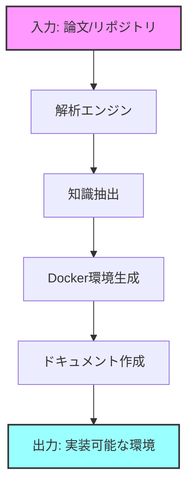

## TOKA: Technical Organization & Knowledge Accumulator

*冬の花が咲くように、技術知識を育む*

> [!NOTE]
> 🚧 このプロジェクトは現在開発中です。以下の内容は開発予定の機能とロードマップを示しています。

## 🌸 概要

TOKAは、技術論文やリポジトリの自動解析・環境構築を行うAIシステムの開発プロジェクトです。[CaL（Comprehend and Learn）](https://github.com/datawhalechina/phidata)の概念を基に、以下の機能の実装を目指しています：

- 📚 技術論文とリポジトリの包括的な解析
- 🔄 実装可能なドキュメントの自動生成
- 🐳 Docker環境の自動構築と設定

## 🎯 開発ロードマップ

### Phase 1: 基盤開発 (進行中)
- [ ] プロジェクト構造の設計
- [ ] 基本的なAPI連携の実装
- [ ] ドキュメント解析エンジンの設計

### Phase 2: コア機能実装 (予定)
- [ ] 論文PDF解析機能
- [ ] リポジトリ構造分析機能
- [ ] Docker設定生成機能

### Phase 3: 自動化と最適化 (予定)
- [ ] 環境構築の自動化
- [ ] パフォーマンスの最適化
- [ ] エラーハンドリングの強化

## 🌟 実装予定の主要機能

### 文献解析基盤
- 論文PDFの自動解析と要約
- 実装に必要な技術要素の抽出
- 引用関係の可視化と関連研究の特定

### リポジトリ分析エンジン
- コードベースの構造解析
- 依存関係の自動マッピング
- 実装パターンの識別と分類

### 環境構築自動化
- Docker-compose設定の生成
- 開発環境の自動構築
- デプロイメントドキュメントの作成

## 🚀 開発参加方法

現在、以下の形での開発参加を募集しています：

1. アイデアの提案
2. 仕様についてのディスカッション
3. 実装予定機能へのフィードバック

### 開発への参加手順

1. このリポジトリをWatchまたはStar
2. [Discussions](https://github.com/yourusername/toka/discussions)で意見や提案を共有
3. [Issues](https://github.com/yourusername/toka/issues)で具体的な機能要望や改善案を提示

## 📋 予定している技術スタック

- **フロントエンド**: (検討中)
  - 候補: Streamlit, Gradio

- **バックエンド**
  - Python 3.9+
  - FastAPI (予定)

- **AI/ML**
  - OpenAI API
  - Claude API
  - Gemini API

- **インフラ**
  - Docker
  - Docker Compose

## 🔄 想定している処理フロー

## 🎋 名前の由来

「TOKA」（冬花）は、厳冬に咲く花を意味します。技術的な複雑さの中から、明確な実装と理解を導き出すという私たちの目指す方向性を象徴しています。

## 📮 コンタクト

現在の開発段階で質問やフィードバックがありましたら、以下の方法でご連絡ください：

- [GitHub Issues](https://github.com/yourusername/toka/issues): バグ報告や機能要望
- [GitHub Discussions](https://github.com/yourusername/toka/discussions): 一般的な質問や議論
- [プロジェクトWiki](https://github.com/yourusername/toka/wiki): 開発ドキュメント（準備中）

## 📜 ライセンス

本プロジェクトは[MITライセンス](LICENSE)の下で開発を予定しています。

---

<i>TOKA - 技術知識を照らし導く</i>

